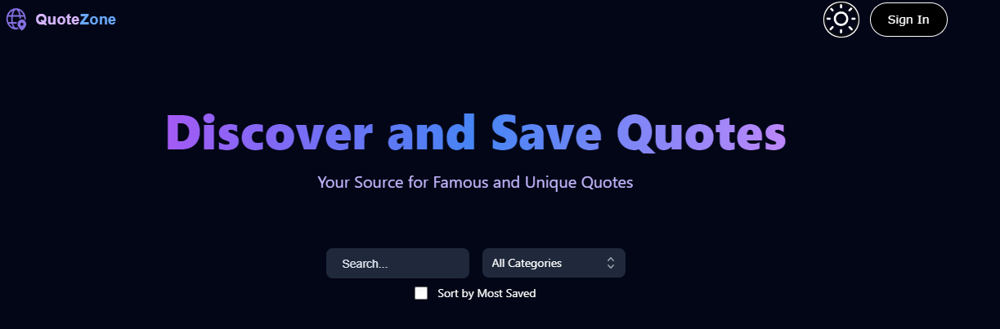

# QuoteZone

QuoteZone is a website for sharing, finding, and saving quotes that you find interesting.

## Demo

Check out the live demo of QuoteZone: [https://quote-zone.vercel.app/](https://quote-zone.vercel.app/)

-

## Features

- Sign in with Google OAuth for authentication.
- Create and delete quotes.
- Save quotes to a dedicated saved page.
- Edit and delete your own quotes from your profile page.
- Toggleble Dark Mode
- Fully mobile compatible.
- Incremental loading in the feed for smooth browsing.

## Technologies Used

- React
- Tailwind CSS
- Next.js
- MongoDB (Database)
- Google OAuth (Authentication)

## Pages
### `/`
    - The main Feed page. Veiw and browse quotes.

### `/create-quote`
    - Create a quote and post it. includes sections for the quote, author, description, catagory.

### `/update-quote`
    - update a quote you've posted.

### `/profile`
    - view the quotes you have posted.

### `/profile/saved`
    - View the quotes you have saved.

### `/profile/[id]`
    - veiw the quotes another user has posted.

## API Routes

### `/api/prompt`

- `GET` method to fetch quotes based on category, text, username, limit, and most saved.

Certainly! Here's the README section with descriptions for each API route:

### `/api/prompt/[id]`

-  `GET` method to fetch a specific quote by ID.
- `PATCH` method to update a specific quote by ID.
-  `DELETE` method to delete a specific quote by ID.

### `/api/prompt/getsaved`

-  `GET` method to fetch saved quotes for a specific user.

### `/api/prompt/new`

-  `POST` method to create a new quote.

### `/api/prompt/save`

-  `PATCH` method to save a quote for a specific user.

### `/api/prompt/save/unsave`

-  `PATCH` method to unsave a quote for a specific user.

### `/api/users/[id]/posts`

-  `GET` method to fetch quotes posted by a specific user.

